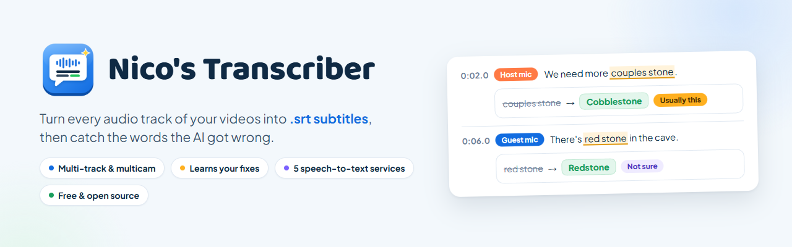
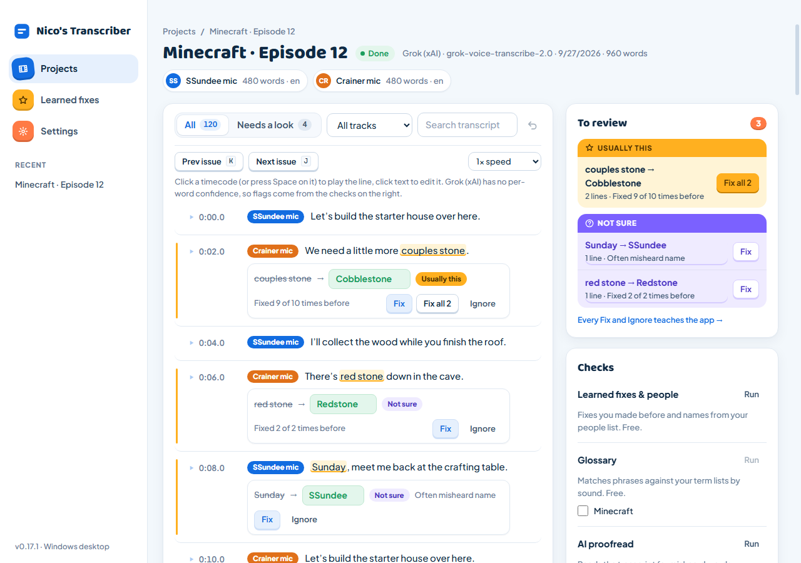
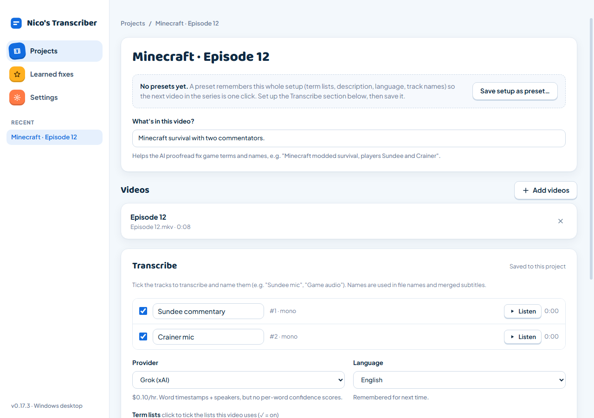
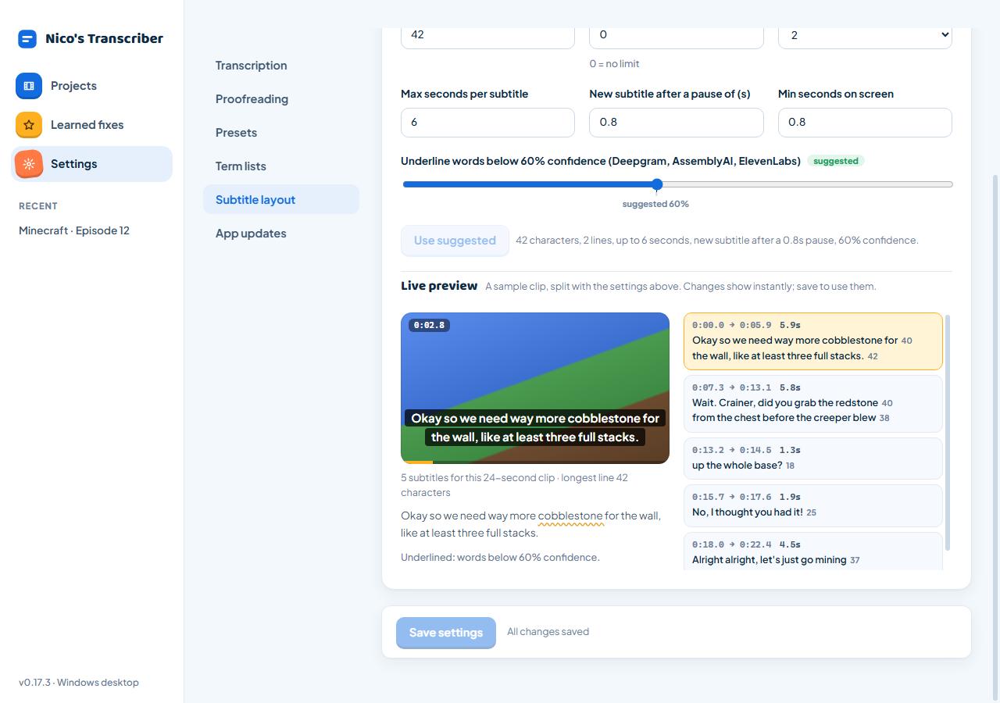
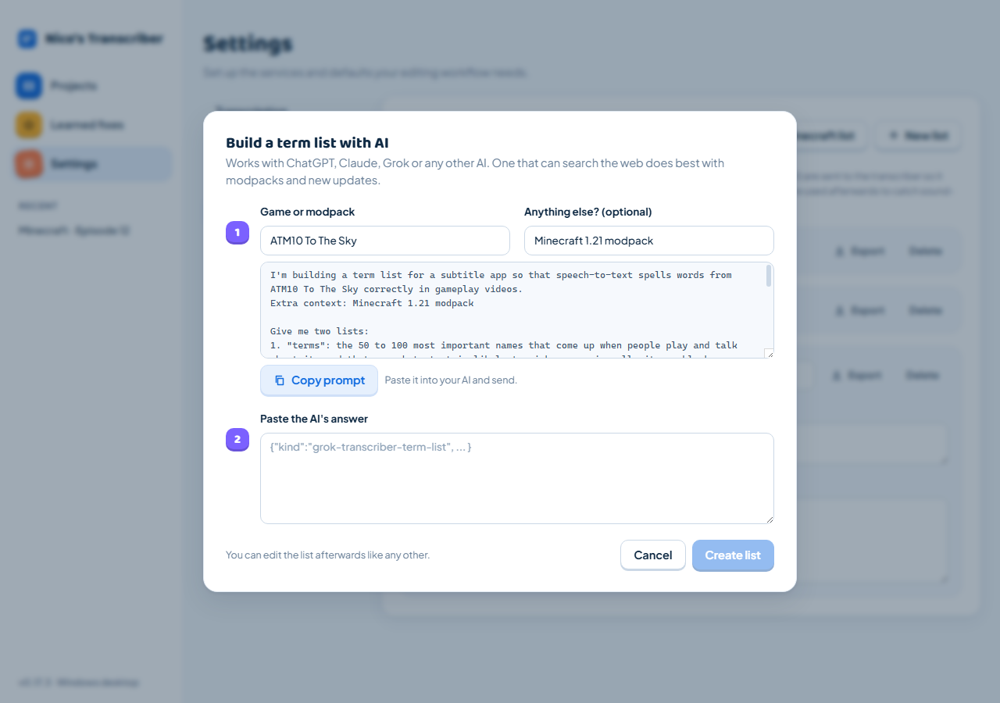
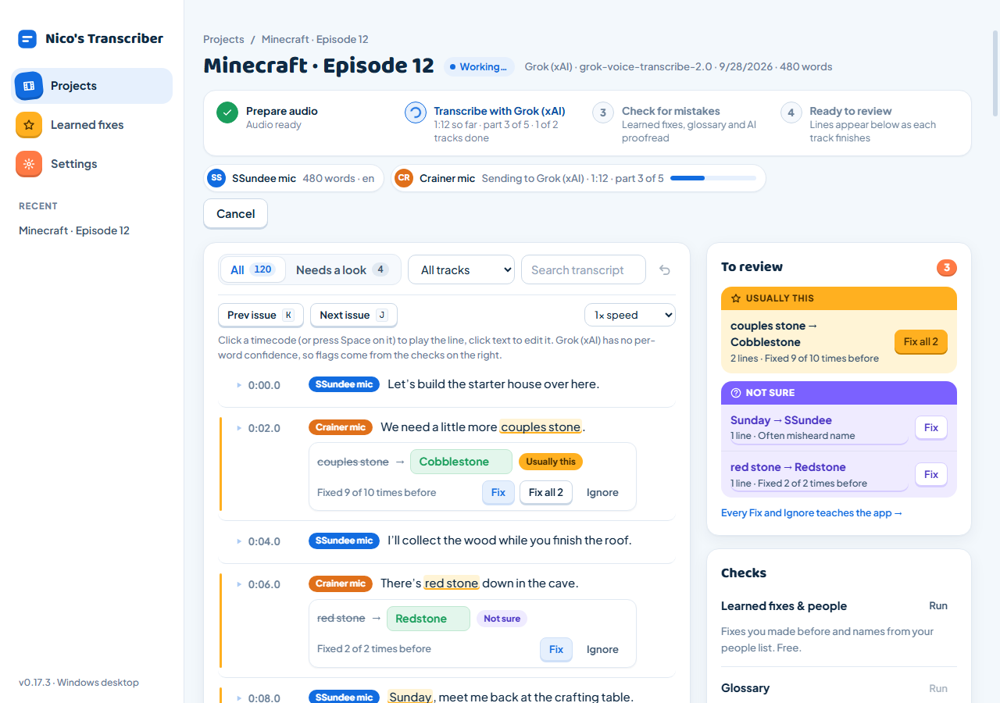

  

  

  
  
  
  

## What it does

- **Drop in videos**: every audio track is pulled out, even multicam.
- **Transcribe** with Grok, Deepgram, AssemblyAI, ElevenLabs or OpenAI (your own API key).
- **Catch mistakes** like "couples stone" → **Cobblestone** with term lists, AI proofread and a second opinion.
- **Learns your fixes**: ones you keep making become one-click **Usually this**.
- **Export .srt files** next to your videos. Your originals are never touched.

## Get started

1. [Download](https://github.com/nicovald/Video-Transcribing/releases/latest) and run the installer. Windows may warn it's unsigned: **More info → Run anyway**.
2. **Settings → Transcription**: paste an API key and save.
3. Drop a video, pick the tracks, hit **Transcribe**.
4. Review the flagged lines, then **Save next to the videos**.

It updates itself.

<table>
  <tr>
    <td width="50%"> <b>Name your tracks, pick a service</b></td>
    <td width="50%"> <b>Tune subtitles with a live preview</b></td>
  </tr>
  <tr>
    <td width="50%"> <b>Build term lists for any game with AI</b></td>
    <td width="50%"> <b>See exactly what it's doing</b></td>
  </tr>
</table>

Screenshots use demo data.

## More

- [User guide](docs/GUIDE.md): every feature, providers, team setup, where your data lives
- [Development](docs/DEVELOPMENT.md): run from source, Docker, API, how it works
- [Changelog](CHANGELOG.md) · [Report an issue](https://github.com/nicovald/Video-Transcribing/issues)

The app is free and [MIT licensed](LICENSE). You pay your speech-to-text service directly. Bundled FFmpeg and other tools have their own licenses: see [third-party notices](THIRD_PARTY_NOTICES.md).
