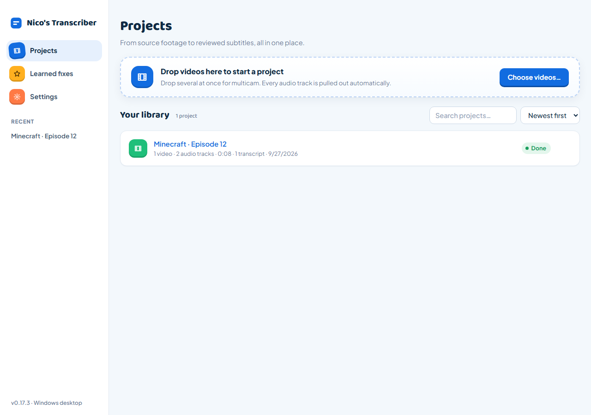

# User guide

[← Back to the README](../README.md)

## What it does

- **Presets** per series or recording setup ("Minecraft vanilla", "ATM10 To The Sky"): description, term lists, player names, language, provider and track layout ("Track 1 = host mic, Track 3 = game audio, skip"). Pick one before dropping videos and the project comes pre-filled; create them from any project with **Save as new preset**.
- **Projects**: drop one or more videos (multicam) and rename the project and each video for your own tracking. Your actual files are never renamed or moved.
- Every audio track is pulled out automatically. Name them ("Host mic", "Game audio") and tick the ones to transcribe.
- Transcribe with **Grok (xAI)**, **Deepgram**, **AssemblyAI**, **ElevenLabs Scribe** or **OpenAI Whisper**. The language and options you pick are remembered.
- **Find mistakes** like "Couples Stone" → "Cobblestone":
  - **Term lists** per game or modpack. Each has *priority terms* (up to ~100, sent to the transcriber) and *all terms* (unlimited, e.g. every Minecraft item). One click adds every vanilla Minecraft name (~1,850, from PrismarineJS/minecraft-data); drop .txt/.csv/.json files for modpacks.
  - **Glossary check** (free, instant) flags phrases that sound like a term but are spelled differently, using a phonetic key plus spelling/vowel checks to avoid flagging ordinary words.
  - **AI proofread** (Claude, OpenAI or Grok) reads the transcript with your project description and suggests fixes. You click **Fix** or **Fix all**.
  - **Compare** transcribes again with a second service and flags every word the two disagree on.
  - Optional **Jev (TypeSafe)** check scores each suggested fix with a confidence %.
- **Review**: edit any line, edit a suggested fix before applying it, and **Undo** (button, toast or Ctrl+Z) any fix, ignore, edit or delete. Use J/K for the next/previous issue, Space on a focused timecode to play, and the speed selector to slow down or speed up playback. Long transcripts show 100 lines per page.
- **Safe export**: preview one SRT per track plus a merged SRT per video, choose the files to save, and keep both versions or explicitly replace existing files.
- **Desktop protection**: API keys are encrypted with Windows account protection. The app warns before closing or restarting with active work or unsaved settings/line edits.
- **Updates itself** from GitHub Releases, so editors install once.

## Using it

You can switch pages while things are running; nothing stops.

Track selections, labels, language and transcription options save automatically with each project. Editing or deleting a preset does not change projects that already use it. When some tracks fail, the transcript shows **Partly complete**; completed tracks remain editable and exportable. **Retry failed tracks** reuses completed audio chunks when the transcription settings are unchanged.

**Learned fixes** (sidebar) is the app's memory. Every **Fix**, **Ignore** and retyped misheard word counts. A fix you keep making becomes **Usually this** (gold, top of the To review panel, one click fixes every line); newer or mixed ones stay **Not sure** (purple). Nothing changes on its own. The **People** list holds the names usually in videos (with real names and known mishearings); names go to the transcriber and the proofreader, and sound-alikes are flagged. To share with the team, click **Export for the team** and send the file; teammates click **Import file** (merging never double counts).

**Term lists** (Settings): **Build with AI** gives you a ready-made prompt for any game or modpack; paste it into your AI, paste the answer back, and the list is created. Lists collapse to one line each. **Export** saves a list as a file; **Import list** adds one a teammate exported.

**Team setup** (for studios): instead of typing keys, an editor can press **Ctrl+Shift+T** and drop a `.env` file you give them. Recognized names: `XAI_API_KEY`/`GROK_API_KEY`, `OPENAI_API_KEY`, `DEEPGRAM_API_KEY`, `ASSEMBLYAI_API_KEY`, `ELEVENLABS_API_KEY`, `ANTHROPIC_API_KEY`, `TYPESAFE_API_KEY`, `GITHUB_TOKEN`. Keys are saved like typed ones and never shown again; other lines are skipped. The same window has **Export my settings** (subtitle layout, proofreading, term lists, presets, learned fixes and people; never keys): give that file to editors too and they drop both in at once. Settings replace layout and proofreading; term lists, presets and learned fixes merge.

Use **Save line** or Enter to save an edited subtitle; Escape cancels, Shift+Enter inserts a line break. A failed save keeps your typed text visible so you can try again. **Fix all** affects only flagged lines recommending that same replacement.

## Updates

The installed app checks GitHub Releases on start and every 4 hours, downloads updates in the background, then shows **Restart to update**. No account or token needed.

## Providers

| Transcriber | Default model | Per-word confidence | Notes |
|---|---|---|---|
| Grok (xAI) | `grok-voice-transcribe-2.0` | No | $0.10/hr. Language must be set for number/date formatting. |
| Deepgram | `nova-3` | Yes | |
| AssemblyAI | account default | Yes | Upload + poll |
| ElevenLabs | `scribe_v2` | Yes (logprob) | |
| OpenAI | `whisper-1` | Per sentence | 25 MB limit → 10-min chunks. `whisper-1` is deprecated (shutdown 2027-02-26). |

| Proofreader | Default model | Key |
|---|---|---|
| Claude | `claude-opus-5` | Anthropic key. Uses structured outputs + server-side refusal fallback. |
| OpenAI | `gpt-6-luna` | Same OpenAI key as above. Fixed to the cheapest GPT-6 to keep costs predictable. |
| Grok | `grok-4.7` | Same xAI key as above. |

Models are editable in Settings. In the desktop app, API keys and the GitHub update token are encrypted in `%APPDATA%\Nico's Transcriber\data\settings.json` (installs from before the rename keep `%APPDATA%\Grok Transcriber`) using Windows account protection; old plaintext keys migrate at startup. The settings backup is also protected. The UI receives only masked values. Audio goes to the selected transcription service, and transcript text goes to enabled proofreaders/verifiers. Browser/Docker mode stores keys in plaintext on its host.

Back up the installed app's `data` folder while the app is closed. Projects, extracted audio and transcripts are local. Protected keys require the Windows account that saved them; do not use a copied settings file to distribute credentials to other employees. Moving projects to another Windows account requires entering keys there again.
